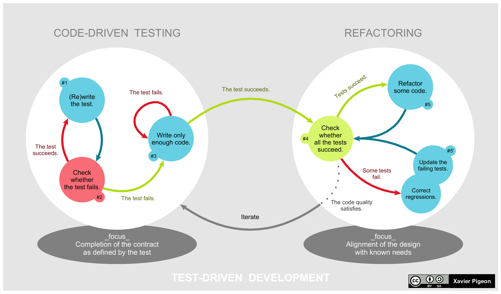

# TDD Kata

## Why TDD?

- TDD is a productivity tool
- TDD is a design tool
- TDD is a learning tool
- TDD is a quality tool
- TDD is a safety net
- TDD is a specification tool
- TDD is a collaboration tool
- TDD is a communication tool
- TDD is a documentation tool

## TDD Rules (the most important part)

- You are not allowed to write any production code unless it is to make a failing unit test pass.
- You are not allowed to write any more of a unit test than is sufficient to fail; and compilation failures are failures.
- You are not allowed to write any more production code than is sufficient to pass the one failing unit test.

## TDD Cycle

1. Write a failing test (_Smallest test possible_)
2. Make the test pass (_Fastest way possible_)
3. Refactor (_Clean code_)
4. Repeat (_Red, Green, Refactor_)
5. You are done when you have a clean code that works (_No duplication, No smells, No comments_)

